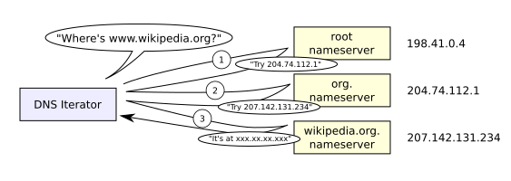
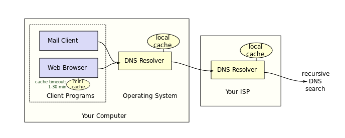

# Wakeful - A watch dog for DNS traffic

Rob Osterburg, Galvanize DSI Fellow

### Motivation
Mapping domain names to IP addresses, DNS is an essential service and access to it is pervasive.  Its importance to network operations means that it is routinely available for good uses and bad.

If the answer to a DNS query cannot be found locally, it is resolved through a recursive series of requests to find a server that can.  By registering domain names, attackers can easily route DNS traffic to their own servers.  Encoded within these packets is the information they seek to transmit.

Attackers use the communication channel that DNS provides to command and control remote processes, such as a botnet, and create tunnels to transfer information assets.  Detecting these malicious uses of the DNS protocol is what my project is all about.

### Feature Engineering
1. Producer consumer ratio (PCR) is a "normalized value indicating directionality of application information transfer, independent of data load or rate."
    * PCR = (Source Bytes - Destination Bytes) / (Source Bytes + Destination Bytes)
    * -1.0 (consumer) <= PCR <= 1.0 (producer)
    * Example: For a compromised workstation, exfiltration represents a switch from consumer to producer

### References
* [Conference Presentation Slides: PCR - A New Flow Metric, Producer Consumer Ratio by Carter Bullard and John Gerth ](https://resources.sei.cmu.edu/asset_files/Presentation/2014_017_001_90063.pdf)
* [Conference Talk Video: Security Onion 2016: C2 Phone Home - Eric Conrad](https://youtu.be/ViR405l-ggg)
* [Conference Talk Video: Chris McCubbin,  Machine learning applied to Bro](https://youtu.be/ZV5Ckf9wLrc)
* [Conference Talk Video: Data Analysis, Machine Learning, Bro, and You! by Brian Wylie](https://youtu.be/pG5lU9CLnIU)
* [Documentation: BNSM DNS Log](https://www.bro.org/sphinx/scripts/base/protocols/dns/main.bro.html#type-DNS::Info)
* [Documentation: BNSM ICMP Log](https://www.bro.org/sphinx/scripts/base/bif/plugins/Bro_ICMP.events.bif.bro.html)
* [Documentation: BNSM Conn Log](https://www.bro.org/sphinx/scripts/base/protocols/conn/main.bro.html#type-Conn::Info)
* [Figure: DNS caching (Lion Kimbro - Own work, Public Domain)]( https://commons.wikimedia.org/w/index.php?curid=386501)
* [Figure: DNS name resolution sequence (Lion Kimbro - Own work, Public Domain)](https://commons.wikimedia.org/w/index.php?curid=386517)
