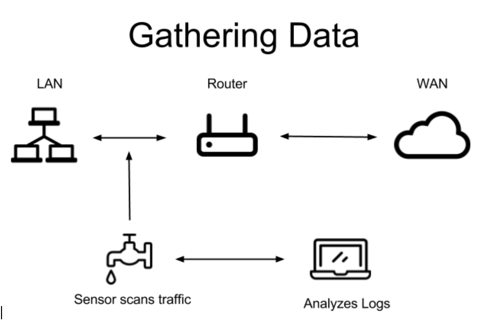
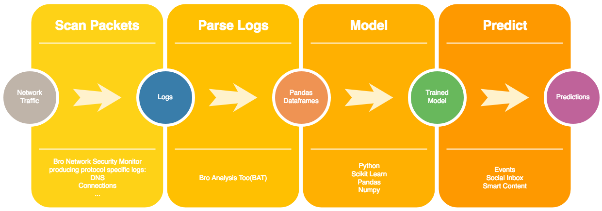

# Wakeful - A watch dog for DNS traffic

Rob Osterburg, Galvanize Data Science Immersive Capstone

### Motivation
DNS maps domain names to an IP address eliminating the need.  This makes for happy users while also providing a perfect backchannel for attackers to communicate unhindered through firewalls.

Attackers use DNS to steal information assets and command and control botnets.  My project focuses on detecting malicious uses of the DNS protocol.

### Goals

* Research methods and engineer features for detecting misuse of the DNS protocol.

* Select best features and evaluate models for predicting malicious use.

* Gain experience applying machine learning to cyber security.

### Data
Security Onion is a distribution of Linux focused on network monitoring and includes the Bro Network Security Monitor (BNSM) that was used to gather all data for this project.  Monitoring my home network with BNSM, I was able to capture roughly 40,000 DNS and 80,000 connection log entries over a period of two weeks.

After finding DNS tunneling “in the wild”, Eric Conrad shared the logs files from three of these attacks on his blog.  These log files contained roughly 6,500 DNS and 3,500 connection log entries.  I used sampling with replacement to rebalance this minority class in my training datasets for each different type of malware.

### Feature Engineering
1. Producer consumer ratio (PCR) indicates the directionality of information transfer.

1. Shannon entropy of the query string.

1. URL reputation using VirusTotal RESTful API.

1. Classify newly registered URLs using whois.

1. Length of the query string and answer string.

### Feature Selection

### Data Pipeline

### Results
To select features, I first removed those that caused data leakage, including IP addresses and port numbers.  Then I used sequential feature selection to identify a set of three features for both the connection and DNS logs that minimized recall (tp / tp + fn), since missing actual attacks represents the highest risk to the organization.

Boosting and random forest models performed the best for classifying connections, and logistic regression did best for DNS traffic.  More feature engineering work is needed to improve the models performance on the DNS log.

### Next Steps
* Model the history of a connection using a Markov chain.

* Use information gain as a feature for classifying DNS queries and answers.

* Develop a virtual lab to generate more consistent datasets.

* Create an application to alert when attacks are detected.

### Tech Stack

### References
* [Conference Presentation Slides: PCR - A New Flow Metric, Producer Consumer Ratio by Carter Bullard and John Gerth ](https://resources.sei.cmu.edu/asset_files/Presentation/2014_017_001_90063.pdf)
* [Conference Talk Video: Security Onion 2016: C2 Phone Home - Eric Conrad](https://youtu.be/ViR405l-ggg)
* [Conference Talk Video: Machine learning applied to Bro by Chris McCubbin](https://youtu.be/ZV5Ckf9wLrc)
* [Conference Talk Video: Data Analysis, Machine Learning, Bro, and You! by Brian Wylie](https://youtu.be/pG5lU9CLnIU)
* [Documentation: BNSM Domain Name Log Data Elements](https://www.bro.org/sphinx/scripts/base/protocols/dns/main.bro.html#type-DNS::Info)
* [Documentation: BNSM Connnection Log Data Elements](https://www.bro.org/sphinx/scripts/base/protocols/conn/main.bro.html#type-Conn::Info)
